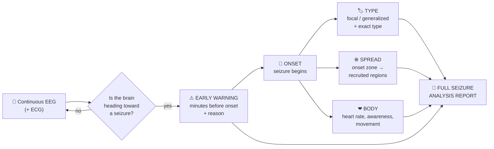

# NeuroMech-Warn

**Earlier Than Ever: Forecasting, Classifying, and Understanding Epileptic Seizures Before They Strike**

> Dataset: Temple University Hospital EEG Seizure Corpus (TUSZ)
> Status: Project definition (objectives only; approach to be decided)

---

## The Big Picture

```
   BRAIN STATE OVER TIME
   ─────────────────────────────────────────────────────────────────────────────►
                                                      t = 0
   calm (interictal)        warning signs (preictal)    │ seizure (ictal)          recovery
   ~~~~~~~~~~~~~~~~~~~~~~   ~~~~~/\/~~~/\/\~~~/\/\/\~~  │ /\/\/\/\/\/\/\/\/\/\     ~~~~~~~~~~
                            ▲                           │ ▲         ▲                ▲
                            │                           │ │         │                │
                     ⚠ FORECAST                     ONSET│ TYPE?    SPREAD?          REPORT
                  "Seizure likely                        │ which    which regions   what happened
                   in ~X minutes"                        │ kind?    get pulled in?  + body reaction
                            ◄──── warning time ────────►│
                                (make this LONGER
                                 than prior work)
```

**One goal above all:** raise the alarm **earlier** than any previous method, then explain *what* the seizure is, *where* it goes, and *how the body will react*.

---

## 1. The Problem

Epilepsy affects around **50 million people** worldwide. The most dangerous part of epilepsy is that seizures strike **without warning**.

- Current AI systems mostly detect a seizure only **after it has already begun**, often seconds too late to act.
- On TUSZ, real-time systems alarm around **15 seconds after onset**, and the strongest recent models do not even report how early they detect.
- Prediction studies on TUSZ report only window-level accuracy (~70% sensitivity, ~60% specificity) with **no fair measure of warning time**.
- Most published prediction results (90–99%) come from patient-specific or leaky evaluations that **do not hold for new patients**.
- Existing systems act as **black boxes**: they say "seizure" but not what kind, where it started, how it spreads, what it will do to the body, or what is happening inside the brain.

---

## 2. Primary Objective

To **detect and forecast epileptic seizures EARLIER** than previous and recent state-of-the-art methods, measured as:

- **(a)** a **longer pre-onset warning time** (minutes before the seizure), and
- **(b)** a **shorter onset-detection latency** (seconds after the seizure begins),

on the TUSZ dataset under a fair, patient-independent evaluation, while keeping **sensitivity equal or higher** and **false alarms equal or lower**.

### Headline claim (to be proven)

> *"On unseen patients, our system warns **X minutes** before seizure onset, compared with **Y minutes** for the best previous methods, at the same false-alarm rate and equal or higher sensitivity, and detects onset **Z seconds** earlier, across every seizure type."*

### Benchmarks to beat

| Stage | Best previous result | Target |
|---|---|---|
| Onset detection (TUSZ) | ~15 s after onset; top recent TUSZ models report no latency | Earlier alarm at the same false alarms / 24 h |
| Onset detection (cross-patient reference) | ~8–16 s after onset | Match or beat |
| Prediction (TUSZ) | ~70% sensitivity, ~60% specificity, no warning time reported | Higher sensitivity at a longer warning time |
| Prediction (cross-patient reference) | ~23 min lead, 74% sensitivity, 0.32 false alarms / hour | Longer or equal lead at ≤ 0.32 false alarms / hour |

---

## 3. Supporting Objectives

Each one either **makes the warning earlier** or **explains the warning**.

| # | Objective | Question it answers | When |
|---|---|---|---|
| 1 | **Forecast from the brain's hidden warning signs** | *Is the brain moving toward a seizure, and how soon?* | Before |
| 2 | **Reveal hidden neural dynamics** | *How is the balance between excitation and inhibition changing inside the brain?* | Before → During |
| 3 | **Classify the seizure type** | *What exact kind of seizure is this?* (focal vs generalized, then the specific type) | Onset |
| 4 | **Map the spread** | *Where did it start, which regions get pulled in, which resist, where will it go next?* | During |
| 5 | **Predict the body's reaction** | *What will the body do?* (heart rate, awareness, staring, stiffening, convulsions) | During |
| 6 | **Visualize the brain at every moment** | *What does the brain look like as the seizure builds, starts and spreads?* | All stages |
| 7 | **Explain and report every event** | *What happened, why was the alarm raised, and how much time was gained?* | After |
| 8 | **Be trustworthy and deployable** | *Does it work on new patients, noisy hospital data, and small devices?* | Always |

### Seizure types to recognise

| Group | Types |
|---|---|
| Focal | Focal non-specific (FNSZ), Complex partial (CPSZ), Simple partial (SPSZ) |
| Generalized | Generalized non-specific (GNSZ), Absence (ABSZ), Tonic (TNSZ), Tonic-clonic (TCSZ), Myoclonic (MYSZ), Atonic (ATSZ) |

---

## 4. Visual Idea: What the System Will Show

### 4.1 The seizure life cycle, end to end



### 4.2 The brain view (dashboard concept)

```
┌──────────────────────────────────────────────────────────────────────┐
│  SEIZURE RISK   ▓▓▓▓▓▓▓▓░░░  78%     "Seizure likely in ~6 minutes"  │
├──────────────────────────────────┬───────────────────────────────────┤
│  3D BRAIN                        │  SCALP MAP (top view)             │
│  activity glowing on the cortex, │  onset zone lighting up and       │
│  moving region to region         │  spreading over time              │
├──────────────────────────────────┼───────────────────────────────────┤
│  BRAIN NETWORK                   │  VIRTUAL NEURONS (digital twin)   │
│  regions as nodes, synchrony as  │  excitatory ● vs inhibitory ●     │
│  links; hubs and resisting areas │  populations and their balance    │
├──────────────────────────────────┴───────────────────────────────────┤
│  EEG  ~~~~~~/\/\/\/\/\/\~~~~~  (seizure shaded)    ECG ♥ 72 → 118 bpm │
├──────────────────────────────────────────────────────────────────────┤
│  TIMELINE  [ calm ····· ⚠ warning ····· 🔴 onset ··· spread ··· end ] │
└──────────────────────────────────────────────────────────────────────┘
```

### 4.3 What one seizure report will look like

```
⚠  WARNING       t = -6 min   risk 78%
                 reason: rising synchrony in left temporal region,
                         excitation/inhibition balance shifting

🔴 ONSET         t = 0
   Type          Complex Partial (focal)          confidence 84%
   Onset zone    Left temporal

🌐 SPREAD        0 s   left temporal          (onset)
                 +4 s  left central-parietal  (recruited)
                 +9 s  left frontal           (recruited)
                 right hemisphere             (resisting)
                 generalization risk          22%

❤  BODY          heart rate 72 → 118 bpm      [measured]
                 awareness likely impaired    [inferred]
                 convulsions unlikely         [inferred]

📄 SUMMARY       Focal seizure, left temporal onset, 52 s, no generalization.
                 Warning given 6 minutes before onset.
```

*(Illustrative example only, not real results.)*

---

## 5. Fair Evaluation Principles

- **Patient-independent:** training and testing patients never overlap.
- Earliness is claimed **only at matched sensitivity and false-alarm rate**.
- Warning time and detection latency reported **per seizure and per seizure type**.
- Performance compared against a **chance-level predictor**.
- Previous methods **re-evaluated on the same data and protocol**.
- Results confirmed on a **second, external dataset**.

---

## 6. Who It Helps

| Who | Benefit |
|---|---|
| **Patients** | More minutes of warning to get safe, call for help, or take rescue medication, before symptoms begin |
| **Hospitals & doctors** | Earlier ICU alarms, automatic seizure typing, onset localization, spread maps, ready-made reports |
| **Neuroscience** | New evidence on how seizures build up, how excitation/inhibition changes, and how seizure types differ |
| **Neurotechnology** | A compact, early, explainable forecasting brain for wearables and Neuralink-style implants that could one day trigger prevention before a seizure takes hold |

---

## 7. What Makes It Novel

- Aims to be **earlier than existing methods**, proven fairly on the same data at the same false-alarm rate.
- **First fair warning-time and latency comparison on TUSZ**, per seizure type.
- **Neuroscience-grounded**, not a black box.
- Covers the **full seizure life cycle** (before, onset, spread, body) in one system.
- A **visual window into the brain**, including a digital twin of neural activity.
- Designed with a **path toward wearables and brain implants**.

---

## 8. Honest Scope

- Scalp EEG measures **large neural populations**, not individual neurons; neuron-level views are **model-based simulations driven by real EEG**.
- Forecasting targets **minutes ahead**, limited by TUSZ recording lengths.
- Body reactions beyond heart rate and muscle activity are **inferred**, not directly observed.
- This is a **research prototype**, not a certified medical device.

---

## 9. Expected Outcomes

- A seizure forecasting system that **warns earlier than previous methods** under fair evaluation.
- Seizure-type classification, spread mapping, body-reaction estimation, and full event reports.
- An interactive **brain visualization dashboard** with a neural digital twin.
- Scientific findings on **pre-seizure brain dynamics** and **per-type warning times**, contributing to clinical AI, computational neuroscience, and neurotechnology.
